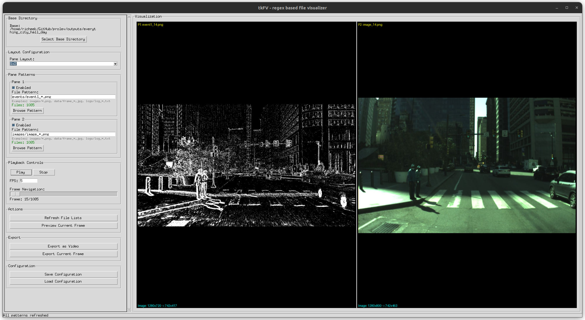

# tkFV - Tk File Viewer

Have a list of image files you want to visualize in parallel? Use tkFV



## How to use?
```
mamba env create -n tkfv -f env.yml
mamba activate tkfv

python3 tkFV.py
```

## Demo
